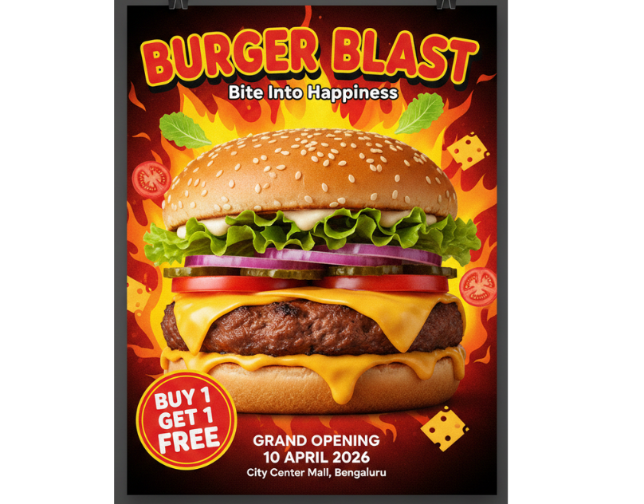

# 🍔 Burger Blast – Grand Opening Poster Design

A bold and eye-catching A3 print poster designed for the grand opening of a fictional fast-food brand, **Burger Blast**.

---

## 📌 Project Overview

This project showcases a vibrant promotional poster created for a restaurant launch campaign.  
The goal was to design an energetic, appetite-inducing layout that attracts young audiences and families.

---

## 🎯 Objective

To create a high-impact print-ready poster that:

- Promotes the restaurant's grand opening
- Highlights the Buy 1 Get 1 Free offer
- Uses bold typography and warm colors to increase excitement
- Creates strong visual focus on the burger

---

## 🎨 Design Concept

- 🔥 Flame background to represent “Blast”
- 🍔 Large, detailed burger image as the focal point
- 🟡 Red & Yellow color palette for food marketing psychology
- 🎯 Offer badge to grab instant attention
- 🖤 Dark background to enhance contrast and depth

---

## 🖌️ Tools Used

- Canva
- High-resolution food mockup
- Print-ready layout setup

---

## 📐 Print Specifications

- Size: A3
- Resolution: 300 DPI
- Color Mode: CMYK
- Bleed: 3mm
- Format: PNG / PDF (Print Ready)

---

## 🧠 Design Highlights

- Strong visual hierarchy
- Clean typography alignment
- Balanced composition
- High contrast for readability
- Professional print-ready export

---

## 📸 Poster Preview

---

## 💼 Portfolio Use

This project is part of my Print Design portfolio showcasing:

- Poster Design
- Promotional Marketing Design
- Food Advertisement Design
- Brand Launch Campaign Visual

---

## 👩‍🎨 Designer

Shraddha  
Freelance Graphic Designer  
Print & Visual Branding Enthusiast

---

⭐ If you like this project, feel free to connect or collaborate!
